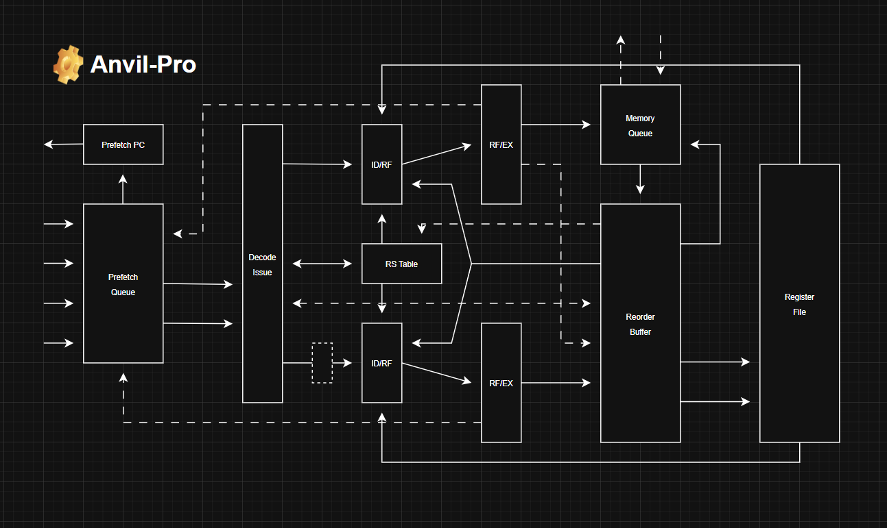

## Architectural Roadmap
- 2-Issue Superscalar Front-End
- In-Order Commit ROB
- Precise Trap / Exception Support
- M-Mode RV32I + Zicsr
- Harvard Split BRAM IMEM + External DMEM
- 256-Bit "Walking Window" Prefetch
- Single LSU (Wishbone Classic)
- Store / Load Buffering + Queue
- 6-Stage Pipeline

## Overview
sds

Anvil-Pro specifically targets FPGA platforms, and is optimized around FPGA specific mechanics such as synchronous BRAM and bus routing to an external RAM chip. 

## Frontend Methodology
Anvil-Pro’s front end is designed to sustain a 2-wide issue demand while minimizing redirect penalty and keeping FPGA fabric cost low. Sharing an external instruction interface with the DMEM subsystem was evaluated and rejected: bus arbitration and protocol state add latency, introduce additional control complexity, and reduce deterministic control of fetch timing. Instead, Anvil-Pro uses a strict Harvard organization. IMEM is implemented as inferred synchronous BRAM, allowing instruction fetch to run independently of LSU traffic.

With BRAM-backed IMEM, the remaining optimization is microarchitectural. Canonical queue-driven fetch buffering was initially deployed, but the additional state (FIFO depth, fill/drain behavior, tagging, and boundary handling) increased area and amplified redirect recovery cost. The final design uses a custom 256-bit “Walking Window” prefetch mechanism that exploits wide BRAM reads and dual read ports. Two adjacent 128-bit aligned windows track the canonical PC and are incremented alongside it. Decode requests are satisfied by slicing 32-bit instructions directly from these windows, allowing the BRAM -> IF/ID path to remain direct with no additional stateful staging.

Redirects are wired directly into the registered BRAM address path, so a control transfer immediately updates the fetch address without draining or refilling an intermediate queue. Because no FIFO sits between BRAM and IF/ID, redirect recovery does not pay a queue drain/refill penalty; the next-path instruction becomes visible as soon as the redirected BRAM read returns. This keeps the front end small, deterministic, and tightly aligned with FPGA memory behavior while still providing enough lookahead to sustain a 2-issue demand under sequential flow.

## Dataflow Diagram

